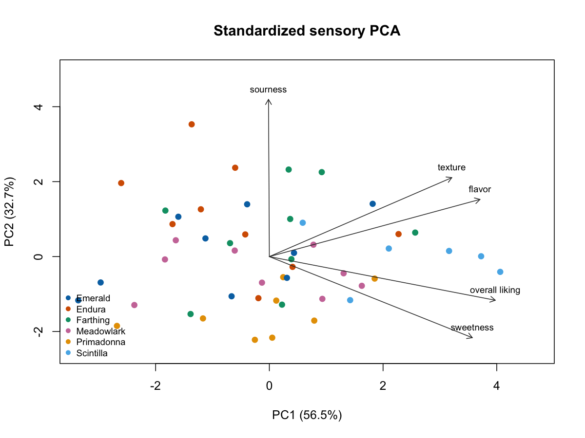

# ブルーベリー官能評価の多変量解析 / Multivariate Analysis of Blueberry Sensory Data

This auditable open-data study analyzes five sensory outcomes for 50 blueberry samples collected across nine location-by-harvest environments in 2013. The source is the CC BY 4.0 supporting data from Gilbert et al. (2015).

The analysis addresses three common risks in exploratory PCA and clustering workflows:

- it treats scaling as an explicit sensitivity question instead of silently using unscaled distances;
- it chooses the number of clusters without looking at the six genotype labels;
- it quantifies PCA and cluster stability while respecting repeated observations across environments.

The primary result is deliberately conservative: the gap statistic selects `k=1`, so the data do not support a natural discrete partition. A forced `k>=2` analysis is retained as an exploratory visualization only. Separately, leave-one-environment-out validation tests whether the five sensory measures carry genotype information that generalizes across environments.



*標準化 PCA：2013 年のサンプル得点と五つの官能特性の負荷量。 / Standardized PCA showing the 2013 sample scores and loadings for the five sensory traits.*

## Reproduce

Requirements: R 4.2.0 with `readxl` 1.4.5, `cluster` 2.1.8.2, and `jsonlite` 2.0.0. Exact direct dependencies are recorded in `renv.lock` and checked by `scripts/check_environment.R`.

Re-download the public S2 workbook, verify its SHA-256, rebuild the 2013 subset, run the analysis, and execute tests:

```bash
make reproduce
```

Run the analysis and tests from the committed, attributed 50-row data snapshot without network access:

```bash
make all
```

Verify the local R package versions:

```bash
make check
```

## Outputs

- [`REPORT.md`](REPORT.md) — full research report generated from results;
- `results/summary.json` — compact machine-readable findings;
- `results/pca_*` — explained variance, loadings, scaling sensitivity, and environment-block bootstrap results;
- `results/cluster_*` and `results/gap_statistic.csv` — internal selection, assignments, stability, and external genotype checks;
- `results/genotype_cv_*` — leave-one-environment-out predictions and confusion matrix;
- `figures/*.png` — compact figures generated by base R's native Quartz device;
- `results/artifact_manifest.csv` — byte sizes and SHA-256 checksums for generated artifacts.

All randomness uses seed `20260929`. Default uncertainty runs use 1,000 PCA block bootstraps, 200 gap-statistic reference samples, 500 environment subsamples, 4,999 cluster-label permutations, and 999 cross-validation permutations.

## Data and licensing

The derived CSV contains no panelist-level records or personal identifiers. It is a subset of the CC BY 4.0 supporting information for:

> Gilbert JL, Guthart MJ, Gezan SA, Pisaroglo de Carvalho M, Schwieterman ML, Colquhoun TA, et al. (2015). *Identifying Breeding Priorities for Blueberry Flavor Using Biochemical, Sensory, and Genotype by Environment Analyses*. PLOS ONE 10(9): e0138494. https://doi.org/10.1371/journal.pone.0138494

Project code and original prose are MIT licensed. The derived data remain CC BY 4.0 and require the attribution above. See [`DATA_CARD.md`](DATA_CARD.md) and [`provenance/SOURCE_AUDIT.md`](provenance/SOURCE_AUDIT.md).

## Interpretation boundary

This is exploratory, non-causal analysis of aggregated sample-level ratings. It does not estimate consumer-level variation, prove genetic causation, or establish universal blueberry preference segments. A cluster number used for visualization must not be presented as a biological taxonomy.
